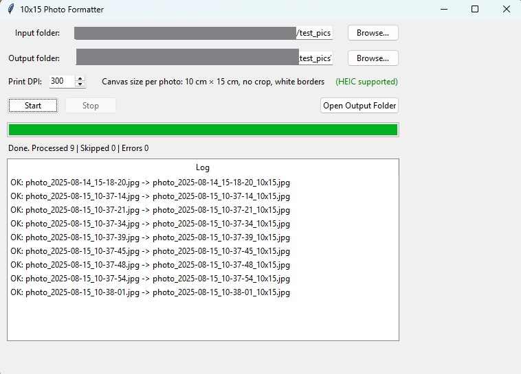

# 10x15 Photo Formatter
A simple Python GUI tool to batch-convert images to print-ready 10×15 cm JPEGs without cropping. It auto-orients, resizes to fit, and adds white borders so the entire photo is preserved.
## Features

- Auto-select input folder via native dialog, choose output folder.
- Scans images recursively (case-insensitive): HEIC/HEIF, JPG/JPEG, PNG.
- Auto-orient via EXIF; aligns the longer side to 15 cm (landscape vs portrait).
- Resizes to fit 10×15 cm without cropping; centers the image with white borders.
- Exports high-quality JPGs with embedded DPI (default 300).
- Preserves EXIF when available; handles PNG transparency over white.
- Cross-platform: Windows, macOS, Linux (Tkinter UI).


## Demo




## Installation and Usage

Requirements:
```bash
  pip install -U pillow pillow-heif
```
Then run the python script:
```bash
  python 10x15_Photo_Formatter.py
```


## How it works

- Each image is auto-oriented using EXIF.
- The app chooses canvas orientation per photo:
- Landscape → 15 cm × 10 cm canvas
- Portrait → 10 cm × 15 cm canvas
- The image is resized to fit inside the canvas (no cropping), centered, with white borders added.
- Output is saved as JPEG with quality 95, optimized, progressive, and with DPI metadata.
- (10×15 cm at 300 DPI ≈ 1181×1772 px.)
DPI metadata helps printers scale correctly; you can adjust DPI (72–600) in the UI.
